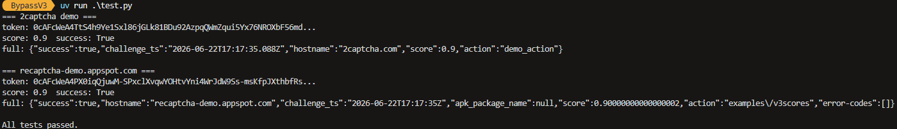

# Bypass invisible reCAPTCHA v3

A simple reCAPTCHA v3 bypass that returns a valid `X-RECAPTCHA-TOKEN` token from a captcha challenge. No browser, no personal device data, no external fingerprint files needed.



## How it works

reCAPTCHA v3's `/api2/reload` endpoint accepts a **protobuf** body (`Content-Type: application/x-protobuffer`). The browser sends a rich payload with mouse/touch events, canvas/audio fingerprints, and timing data generated by Google's obfuscated `webworker.js`. This tool sends a **minimal protobuf body** containing only the required fields plus the action — no device fingerprint, no motion data. Google still issues a valid token; the score is based primarily on IP reputation and the site key, not the fingerprint fields we omit.

### Request flow

1. `GET /api2/anchor?...` — fetch the anchor page, extract the `recaptcha-token` (`c` value), site key (`k`), origin (`co`), script version (`v`), and language (`hl`) from the URL/response.
2. `POST /api2/reload?k=...` — send a minimal protobuf body with fields: `v` (1), `c` (2), `reason` (6), `action` (8), `k` (14). Google responds with JSON: `["rresp","<token>",null,<ttl>,...]` (prefixed with an XSSI guard `)]}'`).
3. The token is returned. Submit it to the target site's verify endpoint.

### Why the action matters

reCAPTCHA v3 binds the **action** (e.g. `login`, `submit`, `examples/v3scores`) into the token at generation time. The server-side verify checks it matches. If you don't send the action, the token has `action: null` and verify returns `action-mismatch` (even though the score may still be high). This tool uses protobuf mode (which embeds the action) whenever an `action=` is provided. If no action is given, it falls back to form-encoded mode (no action embedded).

## Score

**The score varies per request** — typically between **0.1 and 0.9** — and is dominated by factors outside this tool's control:

- **IP reputation** — the biggest factor. Datacenter/VPN IPs get 0.1–0.3; residential IPs get 0.5–0.9. Heavy request volume from the same IP temporarily lowers the score.
- **Site key** — different sites have different scoring thresholds. Some demos (e.g. `recaptcha-demo.appspot.com`) consistently return 0.9; others (e.g. 2captcha demo) vary more.
- **Time of day / volume** — Google's model adapts. Running 50+ tests in quick succession from one IP will depress scores for a while.

This tool does **not** send device fingerprint data (canvas hash, audio fingerprint, mouse trajectories). Adding synthetic fingerprint data was tested and actually **lowered** the score — Google detects fake motion data and penalizes it. A real captured fingerprint (`fingerprint.json` via `tools/extract_fingerprint.py`) can boost the score to a consistent 0.9, but it contains personal device data and gets flagged for reuse after ~20 requests.

**Typical scores with this tool (no fingerprint, residential IP):**

| Site | Score |
| ------- | ------- |
| recaptcha-demo.appspot.com | 0.9 (consistent) |
| 2captcha.com demo | 0.3–0.9 (varies) |

## Usage

```python
from bypass import ReCaptchaV3Bypass

# The anchor URL from the browser's network tab
url = "https://www.google.com/recaptcha/api2/anchor?ar=1&k=..."

# Pass the action the site expects (recommended — embeds it in the token)
gtk = ReCaptchaV3Bypass(url, action="login").bypass()

# Without action (form-encoded fallback, no action in token)
gtk = ReCaptchaV3Bypass(url).bypass()

# With a captured fingerprint for a higher score (optional)
gtk = ReCaptchaV3Bypass(url, action="login", fingerprint_path="fingerprint.json").bypass()
```

### Using your own captured fingerprint (optional, higher score)

By default the tool sends a minimal protobuf body with no device data. For a higher, more consistent score you can capture a real browser fingerprint and pass it explicitly via `fingerprint_path=`.

**Caveat:** the captured fingerprint contains device-specific data (canvas/audio hash, mouse trajectories) and is tied to one device + browser. It gets flagged for reuse after roughly 20 requests, at which point the score drops back to baseline. Refresh it periodically (or use a fresh browser profile) if you rely on it.

#### Step 1: Capture the reload request body

1. Open the target site in Firefox or Chrome (a site with a reCAPTCHA v3 challenge).
2. Open DevTools → Network tab.
3. Trigger the captcha (usually just loading the page or submitting a form).
4. Find the request to `POST https://www.google.com/recaptcha/api2/reload?k=...`.
5. Click it, go to the **Request** tab, look at the **Payload**.
6. Right-click the request → **Copy** → **Copy as cURL** (or "Save all as HAR" if you prefer).

The payload is binary protobuf. You need the raw bytes. Two options:

- **Option A (HAR file):** Right-click the request → **Save all as HAR with content**. Save it as e.g. `capture.har`.
- **Option B (raw body):** In Firefox, in the Request tab of the request, right-click the payload → **Copy** → **Copy as base64**. Save the base64 text to a file, then decode it:

  ```bash
  python -c "import base64,sys; open('reload_req.bin','wb').write(base64.b64decode(open(sys.argv[1]).read().strip()))" copied_b64.txt
  ```

#### Step 2: Extract the fingerprint fields

If you have a HAR file, first extract the bodies:

```bash
uv run python tools/extract_har.py
```

This reads all `*.har` files in `tests/har/` and writes the request/response bodies into `tests/fixtures/`. Find the file named `reload_req.bin` (the POST to `/api2/reload`).

If you already have the raw binary body (`reload_req.bin`), skip to the next command.

Now extract the reusable fingerprint fields:

```bash
uv run python tools/extract_fingerprint.py tests/fixtures/reload_req.bin fingerprint.json
```

You should see output like:

```text
wrote fingerprint.json
  field 5: 11 chars  -1361142321...
  field 7: 921 chars  05AD5oO34C1cjMER3YFQddJykyBIKt-4Njq3B3TMNefi...
  field 16: 5055 chars  0l6uzr5uQRXx4ZFkORUEtItcOCvbroIuAf3VuXpWRf...
  field 20: 325 chars  tbMyw5OCwxNDA3XSxbMSwyMjYsMTUxMl0sWzIsMjcs...
  field 22: 3748 chars  BDAAYAIAGEUgAUoIIwkBCKAMAIlYgAyAABtAgwIAEE...
  field 25: 44 chars  W1tbNTAwNiw0NF0sWzY0NjA3LDFdLFszNTgzNywxXV1d...
  field 28: 20000
  field 29: 30000
```

#### Step 3: Use it

Pass the `fingerprint_path=` argument to include the captured fields in the reload request:

```python
from bypass import ReCaptchaV3Bypass

gtk = ReCaptchaV3Bypass(anchor_url, action="login", fingerprint_path="fingerprint.json").bypass()
```

Without `fingerprint_path=`, the tool uses the default (no fingerprint, no personal data).

#### Verifying what's in your fingerprint

You can decode and inspect any captured body with:

```bash
uv run python tools/proto_decode.py tests/fixtures/reload_req.bin
uv run python tools/decode_body.py tests/fixtures/reload_req.bin
```

#### What each field is

| Field | Wire | Contents | Source |
| ------- | ------ | ---------- | -------- |
| 5 | string | Negative integer (hash/seed) | `webworker.js` |
| 7 | string | Opaque token (`05AD5oO3...`) | Server-provided in a prior reload response |
| 16 | string | Large opaque blob (canvas/audio fingerprint) | `webworker.js` |
| 20 | string | Base64 of JSON: perf timing + host list | `webworker.js` |
| 22 | string | Base64 of binary: JS environment probes | `webworker.js` |
| 25 | string | Base64 of JSON: mouse/touch event array | `webworker.js` |
| 28 | int | `anchor-ms` from anchor URL | URL parameter |
| 29 | int | `execute-ms` from anchor URL | URL parameter |

Fields 7, 16, and 22 are opaque device-bound blobs. They cannot be synthesized meaningfully — random values are detected by Google and lower the score.

## Requirements

- Python 3.12+
- `requests`
- `blackboxprotobuf`

## Tools

The `tools/` folder contains utilities for analysis and fingerprint extraction:

- `proto_decode.py` — decode protobuf wire-format without a schema
- `decode_body.py` — decode captured request/response bodies (CLI)
- `extract_har.py` — extract bodies from HAR files
- `extract_fingerprint.py` — extract reusable fields from a captured reload request
- `generate_fingerprint.py` — synthetic fingerprint generator (experimental)

## Testing

```bash
uv run python test.py
```

Runs live tests against two demo sites (2captcha and recaptcha-demo.appspot.com) and prints the score from each.

## Disclaimer

This program is intended for educational and testing purposes only.
Any misuse or illegal activity using this code is strictly prohibited.
The authors assume no liability for any damage or legal consequences caused by the use of this software.

**Additional Disclaimer**:
This software is provided "as is," without warranty of any kind.
The authors are not responsible for any direct, indirect, incidental, or consequential damages arising from its use or the inability to use the software.
Use at your own risk.

## License

This project is licensed under the AGPLv3 License - see the [LICENSE](LICENSE) file for details.
